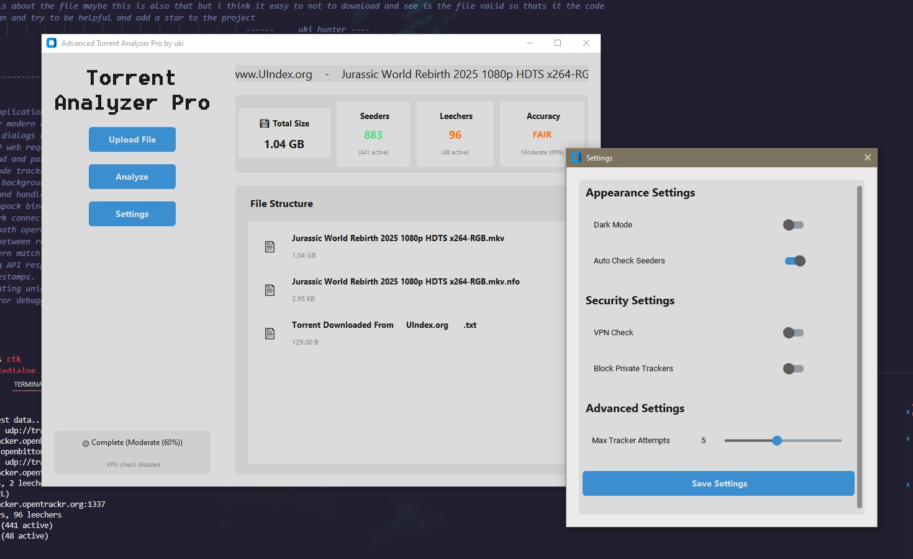

#  Torrent Analyzer Pro

A modern, professional torrent file analyzer with real-time tracker scraping and security features. Built with Python and CustomTkinter for a sleek, modern UI experience.

## ⚠️ Educational Disclaimer

**This tool is for educational and research purposes only.** This software is designed to demonstrate torrent file analysis techniques and modern UI development with Python. Users are responsible for ensuring their use complies with local laws and regulations. The developers do not encourage or condone piracy or copyright infringement. Please respect intellectual property rights and use this tool responsibly.



## ✨ Features

### 📊 Comprehensive Torrent Analysis

- **File Structure Visualization**: View all files and their sizes in an organized list
- **Real-time Tracker Scraping**: Get live seeder/leecher counts from multiple trackers
- **Size Calculation**: Accurate total torrent size display
- **Accuracy Indicators**: Color-coded accuracy ratings for tracker data

### 🛡️ Security Features

- **VPN Detection**: Automatic VPN status checking for privacy protection
- **Private Tracker Blocking**: Option to block private tracker connections
- **Security Status Display**: Real-time security monitoring in the sidebar

### 🎨 Modern UI

- **Dark/Light Theme Toggle**: Switch between appearance modes
- **Professional Design**: Clean, modern interface with Segoe UI font
- **Responsive Layout**: Adaptive design that works on different screen sizes
- **Real-time Updates**: Live data updates without blocking the UI

### ⚙️ Customizable Settings

- **Appearance Controls**: Theme switching and UI customization
- **Security Configuration**: VPN and tracker blocking settings
- **Performance Tuning**: Adjustable tracker attempt limits and auto-checking

## 🚀 Installation

### Prerequisites

- Python 3.7 or higher
- pip package manager

### Install Dependencies

```bash
pip install -r requirements.txt
```

### Run the Application

```bash
python torrentpro.py
```

## 📦 Dependencies

- **customtkinter**: Modern UI framework for beautiful interfaces
- **requests**: HTTP library for tracker communication
- **torrentool**: Torrent file parsing and manipulation
- **bencodepy**: Bencode encoding/decoding for torrent data

## 🎯 Usage

1. **Launch the Application**: Run the Python script to open the analyzer
2. **Upload Torrent File**: Click "Upload File" or drag & drop a .torrent file
3. **Analyze**: Click "Analyze" to start real-time tracker scraping
4. **View Results**: See file structure, seeder/leecher counts, and accuracy ratings
5. **Configure Settings**: Use the Settings panel to customize behavior

## 🌟 Key Features Explained

### Real-time Tracker Scraping

The application connects to multiple torrent trackers using both HTTP and UDP protocols to gather live data about seeders and leechers. This provides accurate, up-to-date information about torrent health.

### Accuracy Indicators

- 🟢 **High Accuracy**: Multiple trackers responding with consistent data
- 🟡 **Medium Accuracy**: Some trackers responding, data may vary
- 🔴 **Low Accuracy**: Few or no tracker responses, data unreliable

### Security Features

- Automatic VPN detection helps ensure your privacy
- Private tracker blocking prevents accidental connections
- Real-time security status monitoring

## 🤝 Contributing

Contributions are welcome! Please feel free to submit a Pull Request. For major changes, please open an issue first to discuss what you would like to change.

## 📄 License

This project is open source and available under the [MIT License](LICENSE).

## 🐛 Known Issues

- Some private trackers may not respond to scraping requests
- VPN detection requires internet connection
- Large torrent files may take longer to analyze

## 💡 Tips

- **For Best Results**: Ensure you have an active internet connection for tracker scraping
- **Privacy**: Enable VPN check for enhanced privacy protection
- **Performance**: Adjust max tracker attempts based on your internet speed
- **Accuracy**: Wait for the analysis to complete for most accurate results

